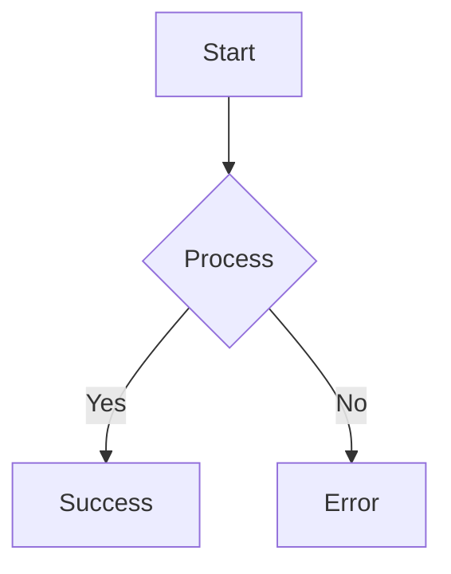

# Mermaid Diagram Renderer

You have the power to visualize complex logic and architecture using Mermaid diagrams.

## 🚀 Capabilities

- **ASCII Rendering**: Renders standard Mermaid syntax (flowcharts, sequence diagrams, etc.) as high-quality ASCII art in the terminal.
- **Visual Synthesis**: Use this to show the user what you are planning or how the system is structured.

## 🛠️ Usage

Simply include a Mermaid code block in your response:

The extension will automatically detect these blocks and render them as ASCII for the user.

## 📋 Best Practices
- **Keep it Simple**: ASCII has limited resolution; keep diagrams focused.
- **Combined with Docs**: Always use this skill when generating architecture documentation via `/skill docs`.
